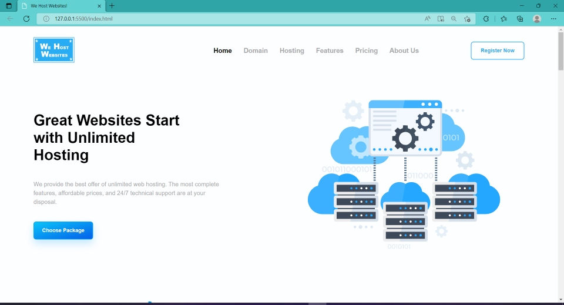
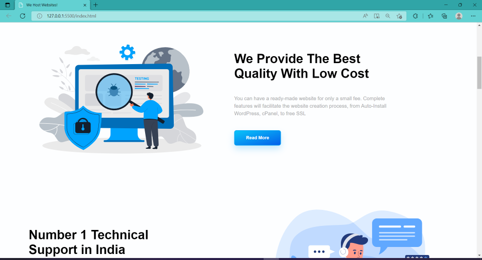
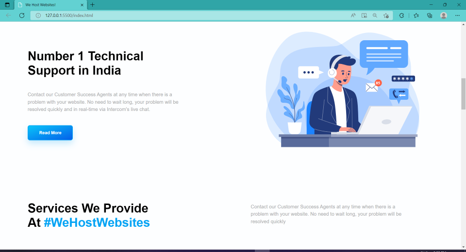
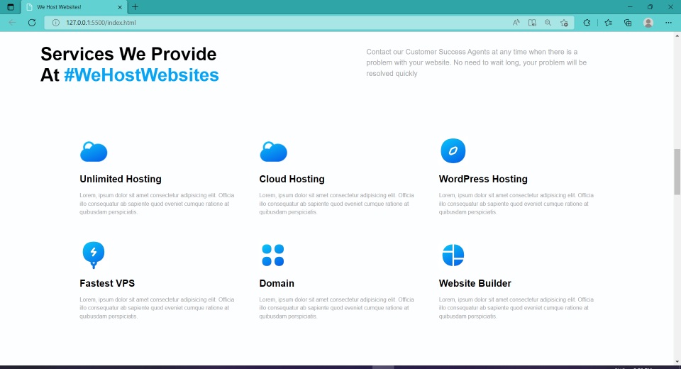
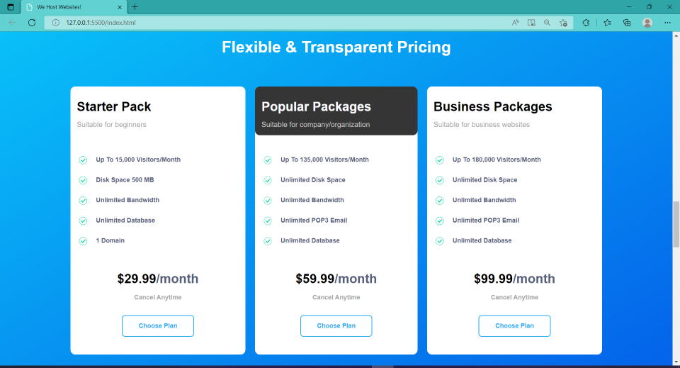
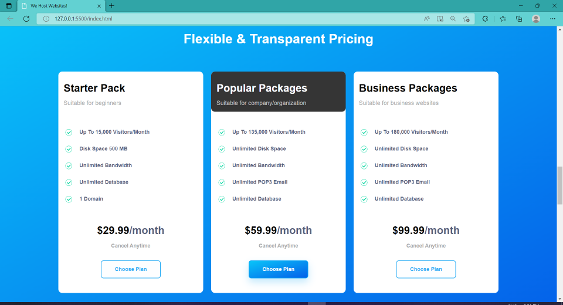
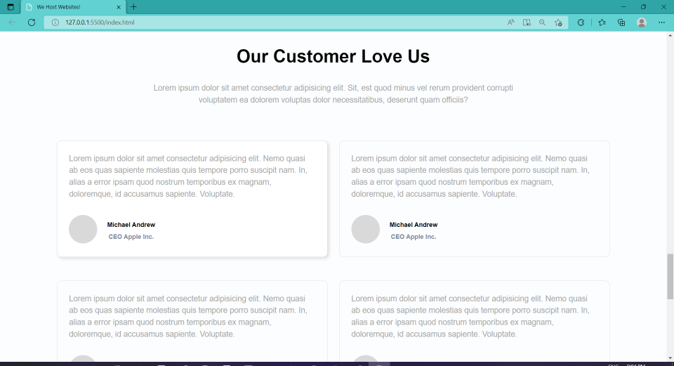
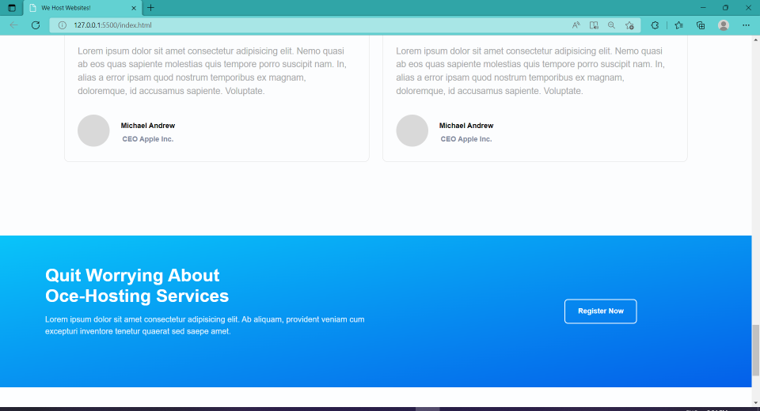
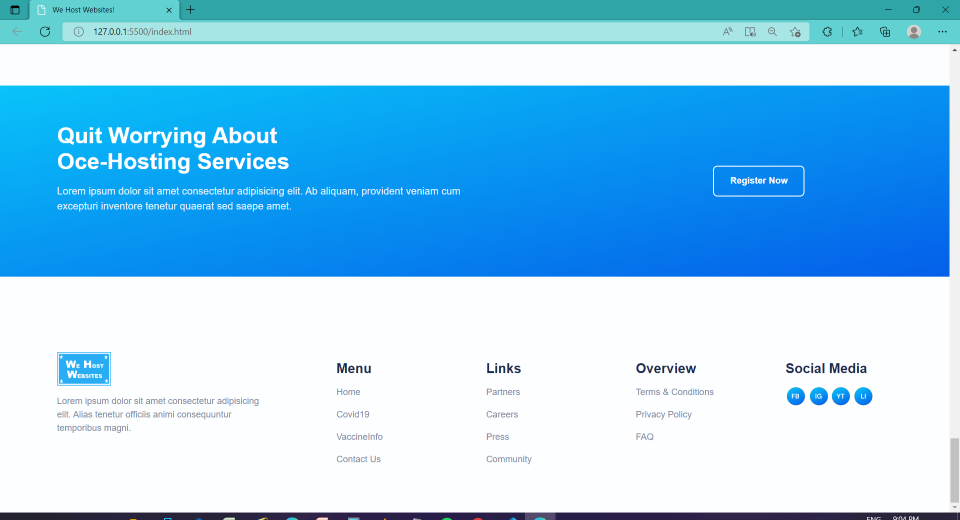

# Project-11 - A-Hosting-Service-Provider's-Landing-Page

## Description:

> A Hosting-Service-Provider's website's fully-responsive Landing page which will be the first web page that the potential client will see when he/she reaches Service Provider's website.

# 

**Landing-Page-Images:**

#

## What I have learnt while making this project?

> I have learned a lot and this project took quite some time as in this project I had to write the HTML as well as decide on the DOM structure of the page, also had to create svg files for many images and icons from the shared combined svg file which was a big task and I again learned a lot about the svg properties like viewBox. 

> In addition to this, I have spent a lot to make the Landing page look exactly as it was looking in the shared image of the Landing page or make it look even better. Not only that, I have put up a lot of effort in making this Landing Page fully Responsive on Desktops as well as Mobile Devices of all sizes.

> Also similar to previous projects, this project also helped me get better with using HTML & CSS to create stunning Landing pages without the use of any external libraries like Bootstrap or Tailwind CSS.

#

## Time taken to complete this project:
> Around 24 hrs spent, over the last 3-4 days, in developing this Landing Page.

#

## Please see this project in action at below link:

**[Click to redirect to Project-11](https://p11-we-host-websites.netlify.app/)**

#

## Developed by:

**Sidharth Pandey**

**[Contact Me](mailto:sidp0008@gmail.com)**

#